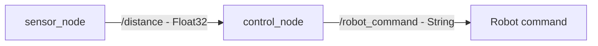

# ROS 2 Autonomous Robot Example

## Projekt leírása

A projekt egy egyszerű ROS 2 alapú autonóm robotvezérlési példát valósít meg.

A rendszer egy szimulált távolságérzékelőt használ. A szenzor másodpercenként egy távolságértéket publikál, amelyet a vezérlő node feldolgoz.

A vezérlő a mért távolság alapján eldönti, hogy a robot:

- `MEHET`
- `ALLJ`

parancsot kapjon.

A projekt ROS 2 Humble környezetben készült Python programozási nyelven.

## Követelmények

- Ubuntu 22.04
- ROS 2 Humble
- Python 3
- rclpy
- std_msgs

## Projekt felépítése

```text
men_sse_kisbead/
├── README.md
├── .gitignore
└── robot_beadando/
    ├── package.xml
    ├── setup.py
    ├── setup.cfg
    ├── resource/
    ├── robot_beadando/
    │   ├── __init__.py
    │   ├── sensor_node.py
    │   └── control_node.py
    ├── launch/
    │   └── robot.launch.py
    └── test/
```

## Node-ok

### sensor_node

A `sensor_node` egy szimulált távolságérzékelőként működik.

Másodpercenként publikál egy új távolságértéket a `/distance` topicra.

Az értékek 5.0 méterről indulnak, majd 0.5 méterenként csökkennek:

```text
5.0 m
4.5 m
4.0 m
3.5 m
3.0 m
2.5 m
2.0 m
1.5 m
1.0 m
0.5 m
```

Ezután a mérés újra 5.0 méterről indul.

### control_node

A `control_node` feliratkozik a `/distance` topicra.

A kapott távolság alapján meghatározza a robot állapotát:

| Távolság | Parancs |
|---|---|
| > 2.0 m | `MEHET` |
| <= 2.0 m | `ALLJ` |

Az eredményt a `/robot_command` topicra publikálja.

## Node és topic kapcsolat

A rendszer működése:



A `sensor_node` a `/distance` topicon keresztül küldi a mért távolságot a `control_node` számára.

A `control_node` feldolgozza a kapott értéket, majd a távolság alapján `MEHET` vagy `ALLJ` parancsot hoz létre.

A döntést a `/robot_command` topicon keresztül publikálja.

## Build

A workspace könyvtárából:

```bash
cd ~/ros2_ws
colcon build --packages-select robot_beadando
```

A build után töltsük be a workspace-t:

```bash
source install/setup.bash
```

## Futtatás

A teljes rendszert egy launch fájllal lehet elindítani:

```bash
ros2 launch robot_beadando robot.launch.py
```

Ez egyszerre indítja el a:

- `sensor_node`
- `control_node`

node-okat.

## Topic ellenőrzése

A rendelkezésre álló topicok megtekintése:

```bash
ros2 topic list
```

A távolságadatok megtekintése:

```bash
ros2 topic echo /distance
```

A robotparancsok megtekintése:

```bash
ros2 topic echo /robot_command
```

## Működés példa

Ha a szenzor 3.0 méteres távolságot mér:

```text
Distance: 3.0 m -> MEHET
```

Ha a távolság 2.0 méterre vagy az alá csökken:

```text
Distance: 2.0 m -> ALLJ
```

A működés:

```text
Távolság > 2.0 m
       ↓
    MEHET

Távolság <= 2.0 m
       ↓
     ALLJ
```

Ez egy egyszerű akadályérzékelésen alapuló autonóm robotvezérlés működését szemlélteti.

## Szerző

Menyhart Gergo

## Technológiák

- ROS 2 Humble
- Python
- rclpy
- std_msgs
- Git
- GitHub
